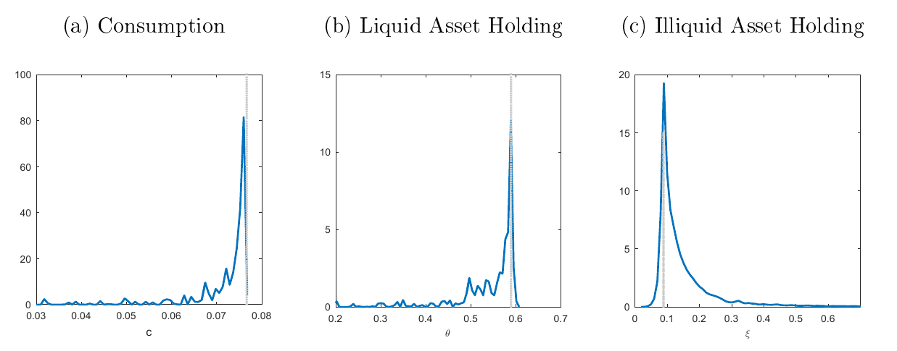
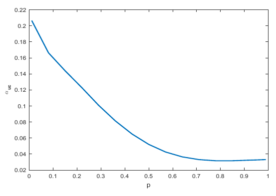
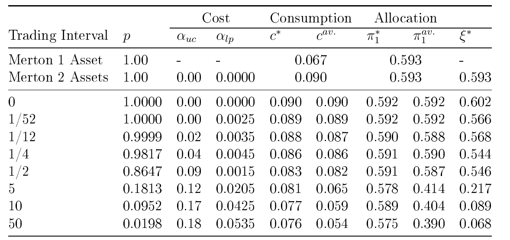
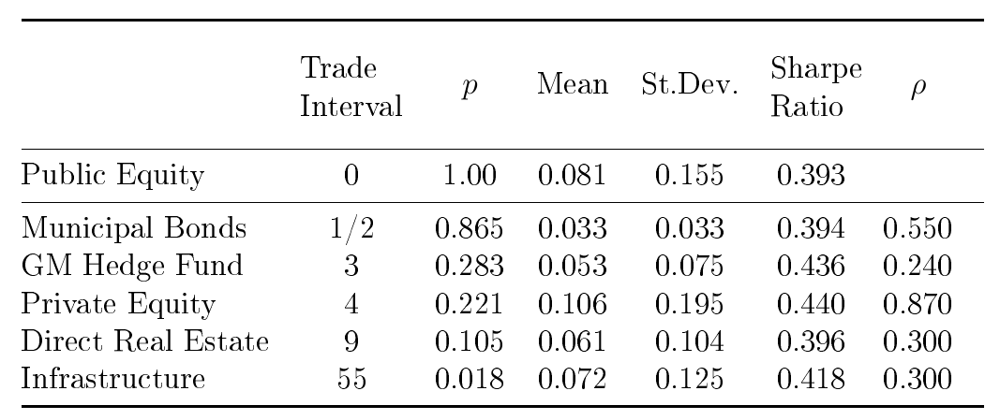
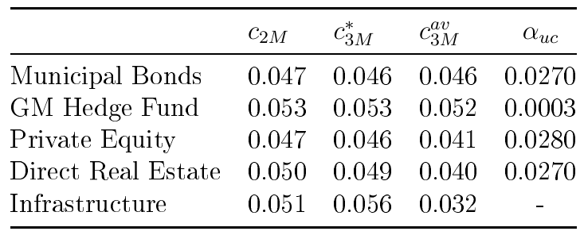
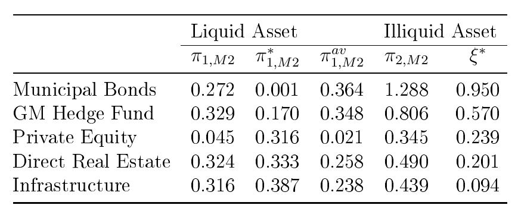

% Portfolio Choice with Liquidity Frictions 
% Master Thesis Defense
% Daniel Dimitrov, Tilburg University

# Why is it Important?

----------------

- Illiquid assets included the portfolios of many investors
	+ long-term institutional investment (pension funds, endowments, sovereign wealth funds etc.)
	+ personal finance (a house, real estate, private company shares, art, jewelry, etc.)
- How to incorporate their properties into the allocation decision?
- How illiquidity affects consumption over the long term?

# What is liquidity?

----------------

Liquidity is hard to define, but *“you know it when you see it.”*
(O’Hara (1995), Market Microstructure Theory)

. . .

- Can be defined accross three dimension 

	- Price: Transaction Costs
	- Quantity: Costless trading but at limited sizes 
	- Time: Search frictions, Lag between placing and order and executing

----------------

Ang, Papanikolaou and Westerfield: Portfolio Choice with Illiquid Assets (2013), NBER Working Paper

- Liquidity as the outcome of a random process: <stochastic opportunity to trade>Search friction
	- A trade in the illiquid asset can occur only with uncertainty about the timing
	- The investor is able to consume only out of liquid wealth while allowed to transfer between the liquid and illiquid with uncertain timing
- Wealth implications when liquidity is stochastic

# Liquid Market

The Market
--------------
$$\frac{\bm{dS}_t}{\bm{S}_t} = \bm{\mu} dt + \bm{\sigma}\bm{dZ}_t$$

$$\frac{dS_t}{S_t} = \bm{\mu} dt + \sigma dZ_t$$
$$\frac{\bm{dS}_t}{\bm{S}_t} = (r \mathbb{1} + \bm{\sigma}\bm{\lambda}) dt + \bm{\sigma}\bm{dZ}_t $$

--------------

### Wealth Dynamics

\begin{equation}\label{eq:WealthWithConsumption}
\begin{aligned}
\frac{dW_t}{W_t} &= (r + \bm{\pi}_t '(\bm{\mu}-r \mathbb{1})- c_t)dt + \bm{\pi}_t'\bm{\sigma} \bm{dZ}_t \\
         &= (r + \bm{\pi}_t '\bm{\sigma} \bm{\lambda}- c_t)dt + \bm{\pi}_t'\bm{\sigma} \bm{dZ}_t
\end{aligned}
\end{equation}

### Preferences

\begin{equation}\label{eq:indirectUtility}
V(W,t)= \sup_{(\pi_s,C_s)\in\mathbb{A}_t}E_{t}\int\limits_{t}^{\infty}{\mathrm{e}^{-\beta (s-t)}u(C_s)}ds
\end{equation}

## The Market is Complete ...

- A *complete market* is one, in which any future uncertain pay-off is attainable, in the sense that a portfolio strategy can be constructed that will produce any possible uncertain pay-off in the future given only that the strategy has an appropriate initial budget.

$$
\frac{dS_{it}}{S_{it}} = (r + \sum_{j=1}^{n}\sigma_{ij}\lambda_{jt}) dt + \sum_{j=1}^{n}\sigma_{ij}dZ_{jt} ,\quad \quad i=1,...,n
$$

## ... and arbitrage free

- An *arbitrage opportunity* is a self-financing trading strategy which starting with zero investment cost generates a non-negative payoff with probability 1 and positive payoff with positive probability.

. . .

- For every possible sate of the world we can set up a unique self-financing strategy that mimics its payoff.

--------

- The Martingale Solution Method 

$$
\begin{equation}\label{eq:ProblemOptStatic}
\begin{aligned}
& \sup_{(c_s)}{E\left[\int_{0}^{\infty}{\mathrm{e}^{-\beta s} u(C_s)}ds\right]} \\ 
& \text{s.t. }E \int_{0}^{\infty}{M_sC_sds} = W_0 M_0 
\end{aligned}
\end{equation}
$$

. . .

- Dynamic Programming Approach

$$
\begin{equation}\label{eq:ProblemOptDynamic}
\begin{aligned}
&\sup_{(\bm{\pi}_s,c_s)}{E\left[\int_{0}^{\infty}{\mathrm{e}^{-\beta s} u(C_s)}ds\right]} \\
& \text{s.t. }dW_s = W_s (r + \bm{\pi}_s' \bm{\sigma \lambda} )ds - C_s ds + W_s \bm{\pi}_s'\bm{\sigma} dZ_s
\end{aligned}
\end{equation}
$$

--------
## Optimal Solution

. . .

- Consumption

$$
\begin{align}\label{eq:optcMartingale}
c_t^*= \frac{\beta+r(\gamma - 1)}{\gamma} + \frac{1}{2} \frac{\gamma-1}{\gamma^2}\lVert \bm{\lambda} \rVert ^2                                        
\end{align}
$$

. . .

- Allocation

\begin{equation}\label{eq:optPiMartingale}
\bm{\pi}_t^* = \frac{1}{\gamma}(\bm{\sigma}')^{-1}\bm{\lambda} = \frac{1}{\gamma}(\bm{\sigma\sigma}')^{-1}(\bm{\mu} - r \mathbb{1})
\end{equation}

# Illiquid Market

## The Market

- Riskless asset $dB_t=rB_tdt$
    
- Liquid risky asset $dS_{1t}/S_{1t} = \mu + \sigma dZ_{1t}$
    
- Risky illiquid asset $dS_{2t}/S_{2t} = \nu + \psi \rho dZ_{1t} + \psi \sqrt{1-\rho^2} dZ_{2t}$
    
- The investor cannot be certain that a market for asset $S_2$ will exist over time. 
- The asset will be tradable with probability $p$ and will be illiquid with probability $1-p$.
	
## Wealth

+ Consume out of liquid wealth only. 
+ Illiquid wealth can be consumed only after converting it to liquid by transferring the amount $dI$ if there is a trading possibility (determined by probability $p$).  

+ Wealth evolves according to

\begin{align}
dw_t/w_t & = (r+(\mu - r)\theta_t - c_t)dt + \theta_t\sigma dZ_{1t} - dI_t/w_t   \label{eq:w} \\ 
dx_t/x_t & = \nu dt + \psi\rho dZ_{1t} + \psi \sqrt{1-\rho^2} dZ_{2t} + dI_t/x_t    \label{eq:x} \\
W_t & = w_t + x_t \label{eq:W}
\end{align}

## Value 

\begin{equation}
V(w_t,x_t) = \sup_{\theta, dI, c} E_t \left[\int\limits_{t}^{\infty} \mathrm{e}^{-\beta (s-t)} u(c_s,w_s)ds\right]
\end{equation}

- Becomes a function of Wealth and $\xi$ only

$$V(kw_t,kx_t) = \sup_{\theta, dI, c} E_t \left[\int\limits_{t}^{\infty} {\mathrm{e}^{-\beta (s-t)} \frac{(kc_sw_s)}{1-\gamma}^{1-\gamma}}ds\right] = k^{1-\gamma}V(w_t,x_t)$$

$$V(w_t,x_t) =(W_t)^{1-\gamma}V\left(\frac{w_t}{x_t + w_t},\frac{x_t}{x_t + w_t}\right) = W_t^{1-\gamma}V\left((1-\xi),\xi\right)$$

\begin{align}
H(\xi) \equiv V((1-\xi),\xi) \\
V(w_t,x_t) = W_t^{1-\gamma} H(\xi_t)
\end{align}

---------

### Optimal illiquid investment $\xi$

$\xi^* = arg\max_\xi H(\xi)$ 

### Optimal Consumption

$$u'(cw) = V_w$$ 

\begin{equation}\label{eq:consumptionAng}
c^{opt} = \Big((1-\gamma)H(\xi)-H'(\xi)\xi \Big) ^{-\frac{1}{\gamma}} (1-\xi)^{-1}
\end{equation}

### Optimal liquid investment $\theta$

- From the HJB PDE equation by Ang et al. (2013)

\begin{equation}\label{eq:thetaAng}
\theta^{opt} = -\frac{k_1H(\xi)+k_3H'(\xi)+k_5H''(\xi)}{k_2H(\xi)+k_4H'(\xi)+k_6H''(\xi)}
\end{equation}

---------

- The Bellman Equation Discretized & Decomposed

$\begin{aligned}
V(W_t,\xi_t)   =   & \max_{(\theta_t,dI_t,c_t \in \mathcal{R})}\{u(c_t (1-\xi_t) W)\Delta t \\
	& + \mathrm{e}^{-\beta \Delta t} E_{W,\xi}[ V(W_{t+\Delta t}, \xi_{t+\Delta t})]\}  \\
W_t^{(1-\gamma)} H(\xi_t)  =  & \max_{(\theta_t,dI_t,c_t \in \mathcal{R})}\{W_t^{(1-\gamma)} u(c_t (1-\xi_t) )\Delta t \\ 
	& + \mathrm{e}^{-\beta \Delta t} E_{W,\xi}[ W_{t+\Delta t}^{(1-\gamma)} H(\xi_{t+\Delta t})]\} 
\end{aligned}$

$\begin{aligned}
    W_t^{(1-\gamma)} H(\xi_t) = & \max_{(\theta_t,dI_t,c_t \in \mathcal{R})}\{W_t^{(1-\gamma)} u(c_t (1-\xi_t) )\Delta t \\ 
	& + \mathrm{e}^{-\beta \Delta t} 
        (p E_{W}[ W_{t+\Delta t}^{(1-\gamma)}] H^*
        +(1-p)    E_{W}[ W_{t+\Delta t}^{(1-\gamma)} H(\xi_{t+\Delta t})])\} 
\end{aligned}$

$\begin{aligned}
    H(\xi_t)  =  & \max_{(\theta_t,dI_t,c_t \in \mathcal{R})}\{u(c_t (1-\xi_t) )\Delta t  \\ 
	& + \mathrm{e}^{-\beta \Delta t}
        (p H^* E( R_{t+\Delta t}^{(1-\gamma)}) +(1-p)
        E[R_{t+\Delta t}^{(1-\gamma)} H(\xi_{t+\Delta t})]
        )\}
\end{aligned}$

---------

- State Transition Dynamics

- Trading probability $p$ can be calibrated through a the Poisson distribution

\begin{equation}
p = 1- \mathrm{e}^{-\eta \Delta t}
\end{equation}

---------

<Calibrating the Trading Probability>

### Smooth Approximation Algorithm

\begin{equation}
V(W,t)= \max_{c\in\mathcal{D}(W,t)}u(cW)+\delta E[V(W^+|W,c)]\equiv(\mathcal{T}V(W^+))
\end{equation}

**Initialization:** Choose functional form $\hat{V}(W;a)$ and chose approximation grid for the wealth variable $\omega={\omega_1,...,\omega_n}$. Make initial guess $\hat{V}(W;a^0)$ and choose stopping criterion $\epsilon$. 

- **Step 1:** \textbf{Maximization}: Compute $v_j=(\mathcal{T}\hat{V}(W,a^i)(\omega_j))$ for each $\omega_j \in \omega$, $j = 1,...,n$

---------

- **Step 2:** \textbf{Fitting}: Compute $a^{i+1} \in R^n$ such that $\hat{V}(W;a^{i+1})$ approximates $(v_j,\omega_j)$ . One possible approach to the fitting step is to use least squares:

    $$\min_{a\in\mathcal{R}^n} \sum\limits_{j=1}^{n}(\hat{V}(\omega_j;a)-v_j)^2$$
	
- **Step 3:** If $\|V^{i+1}-V^i\|< \epsilon$ stop, otherwise go to **Step 1**.     

---------

- Smooth Approximation applied on the Decomposed Illiquid Bellman: 

$$\hat{H}(\xi;\bm{a})= a_0+a_1\xi+a_2\xi^2+....+a_8\xi^8$$ Our goal is to find the parameters $a_1, ..., a_8$.

- Value Function Iteration

$\begin{aligned}
    H(\xi_t) = & \max_{(\theta_t,dI_t,c_t \in \mathcal{R})}\{ u(c_t (1-\xi_t) )\Delta t \\
	& + \mathrm{e}^{-\beta \Delta t} (p H^* E[ R_{t+\Delta t}^{(1-\gamma)}] +(1-p)E[ R_{t+\Delta t}^{(1-\gamma)} H(\xi_{t+\Delta t})]\}  \\
		& \equiv(\mathcal{T}H(\xi_{t+ \Delta t})) = h_j
\end{aligned}$

# Key Findings

------------

- Clear adverse effect from illiquidity on the optimal illiquid asset holdings

<only liquid wealth can be used to fund immediate consumption>

------------

## State Dependency

- At high illiquid asset endowment levels the investor will tend to reduce 
	- the allocation the liquid asset 
	- consumption

. . .

	
- Consumption is reduced proportionately to the level of the friction 
	- lower diversification
	- higher risk that liquid wealth could be exhausted before a trading opportunity arrives 
	
------------
	
### 1 Year Average Waiting Time

------------

### 10 Year Average Waiting Time

------------

- An infinitely lived agent is able to rebalance often enough to avoid being stuck with too much illiquid wealth

- Still creates enough situations where liquid risky holdings need to be cut down

- Fluctuations in illiquid wealth increase risk aversion

<fat left tail in the distribution of the consumption rate over time> 

------------

- Positive dependency between the degree of the liquidity friction, the utility cost and the liquidity premium. 

------------

### Sensitivity to the Trading Interval

------------

- Diversification benefits from low correlation between the liquid and illiquid assets are muted relative to the model with no frictions 

- Utility cost is much stronger for assets with high negative correlation

## Asset Class Data

- JP Morgan Capital Market Assumptions 2016: 10 Year Forecast

- Liquidity based on Ang et al (2013)

------------

### consumption

------------

### allocation

<Notes>
<Scale Image 

# Questions